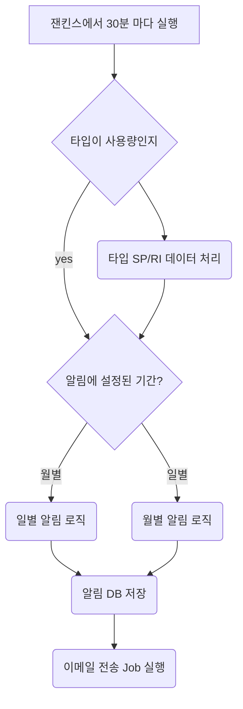
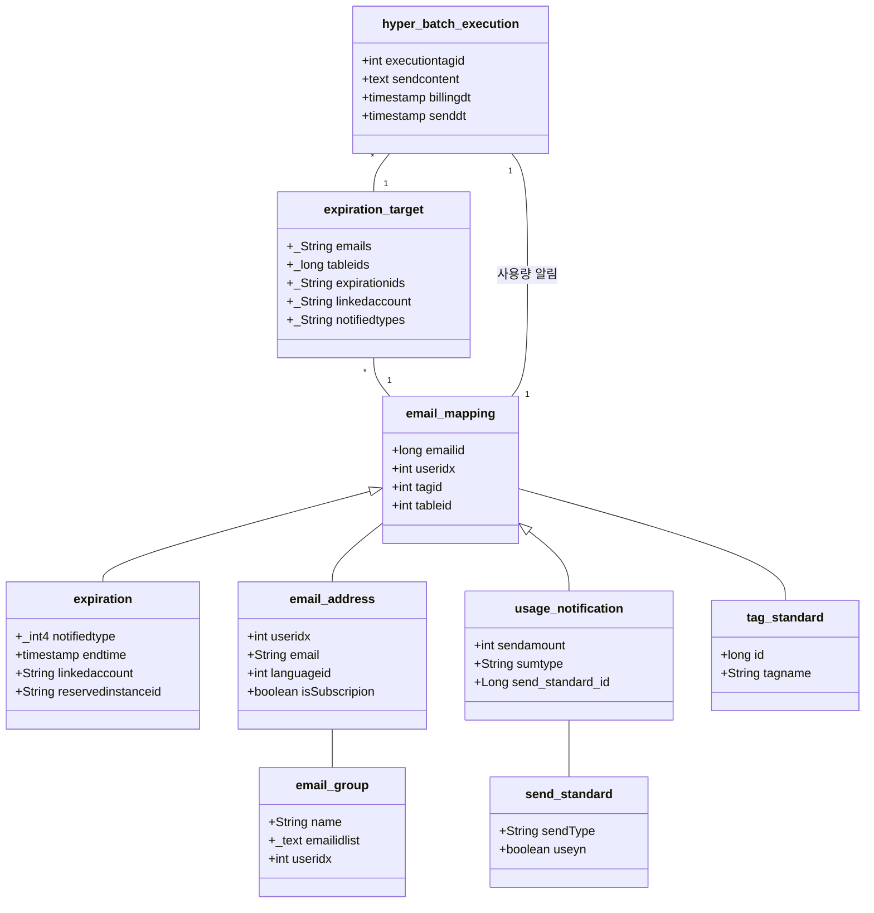
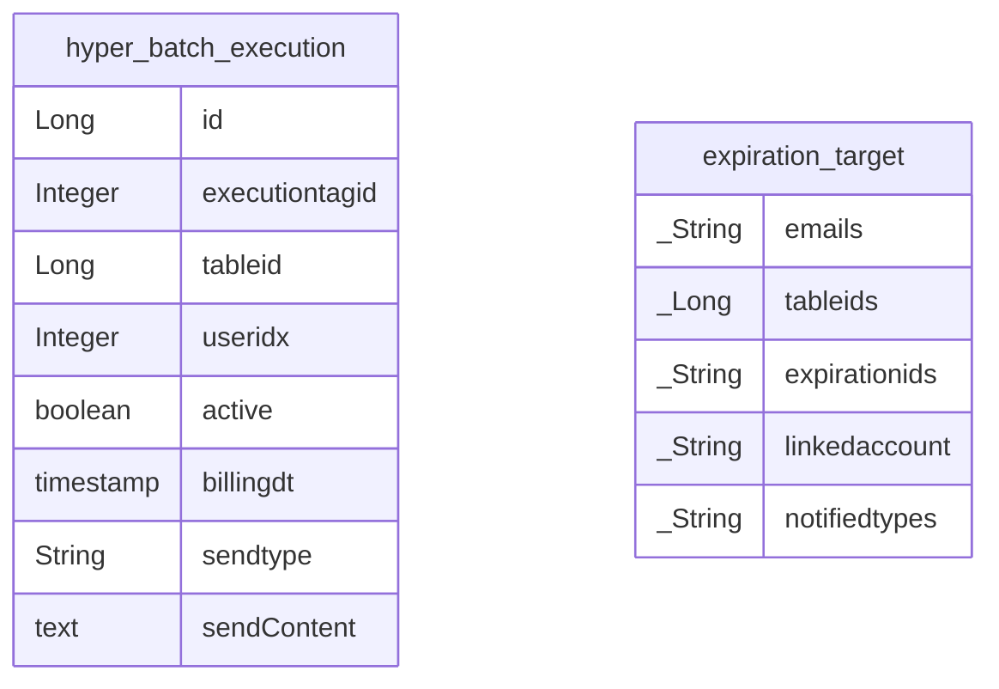
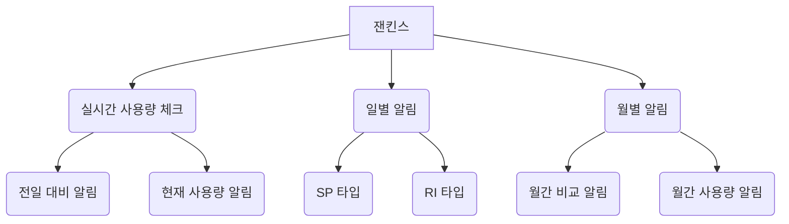

# 🪴 career-WBS
> mermaid로 작성된 과제는 마크다운 파일(WBS.md)로 올려주시면 됩니다. (md 파일 내에 기존 구조를 넣어주세요) <br>
> 별도 아키택쳐나 모델링 도구를 사용한 경우에는 마크다운 파일(WBS.md)과 png, gif, jpg, pdf 파일 형식으로 WBS-{gitID}.png 파일명으로 upload 해주세요
# 요구사항
- [x] 개선하려는 프로젝트의 최종 설계
    - [x] 변경 사항에 대한 Target 시스템 설계를 확정한다. (2주차 미션 활용)
    - [x] 변경 사항에 대한 기대효과를 확정한다. (2주차 미션 활용)
- [x] task list 도출
    - [x] 현 시스템에서 변경되는 부분을 class diagram(DB변경이 발생할 경우 ERD추가)으로 작성
    - [x] 변경, 추가 될 프로그램들의 작업 목록을 작성한다.
- [ ] 일정 계획 문서 (WBS)
  - [ ] 작업목록의 소요일정을 산정 한다.
  - [ ] 작업 목록의 의존성을 정의 한다.
  - [ ] 작업 목록의 전체 일정을 작성한다.
  - [ ] 진행 상태를 check하기위한 마일스톤 설정 한다.


# 🚀미션
## AS-IS

### AS-IS 개선포인트 분석

- __과중한 단일 Job__:\
  현재 배치 Job이 너무 많은 기능을 수행하고 있으며, 다양한 타입의 알림을 한 번에 처리하고 있습니다. 이는 작성한 사람만 아는 코드가 되버립니다.
- __Job의 작동시간__:\
  하나의 Job이 과도하게 크고 복잡할 경우, 실행 시간이 길어지며 이는 고객에게 알림을 전달하는 시간의 지연을 초래할 수 있습니다.\
  중간에 실패한 타입 때문에 전체 Job이 재실행되는 구조는 효율성을 크게 저하시키며, 이는 시스템 자원의 낭비와 서비스 지연을 초래할 수 있습니다.
- __테스트 환경의 불안정성__:\
  배치 테스트는 개발(dev) 환경의 Elasticsearch 서버에 직접 요청하여 진행되고 있습니다. 이로 인해 테스트 데이터의 유무에 따라 테스트 결과가 변동되는 문제가 있습니다.


### AS-IS 프로세스



### Class diagram
- AS-IS 구조에서 개선을 할때 영향을 받게되는 class diagram을 작성한다.




### ERD
-AS-IS 구조에서 개선을 할때 영향을 받게되는 ERD를 작성한다.



## TO-BE 
### TO-BE 기대효과 분석

- __개별 Job__:\
  타입별 Job을 나눠준다. 그리고 각기 Job들이 한가지 알림을 처리하도록 한다.
- __테스트 개선__:\
  배치 테스트에서 외부 서버를 Mocking해서 테스트가 다른 서버에 의존하지 않도록 한다.
- __Job 상태 저장__:\
  특정 잡이 실패했을 때, 현재는 batch_job_execution에서 실패 이유를 추적해야하였는데,\
  이를 개선하기 위해서 특정 잡의 실행 상태와 이유를 저장한다.  


### TO-BE 프로세스



### class diagram
- class diagram
```mermaid```
    

### ERD
- TO-BE 구조에서 변경되는 ERD를 작성한다.
```mermaid```

## Task List
1. Timeout 발생 시 Event발생 수정- SQS, SNS <br>
2. Timeout event subscription module 작성<br>
3. Timeout log table 설계, 생성<br>
4. Timeout 재처리 service 설개, 구현<br>
&nbsp; &nbsp; 1. transaction 성공여부 확인 <br>
&nbsp; &nbsp; 2. transaction 취소 처리 하기 (결제시)<br>
&nbsp; &nbsp; 3. 재처리 logging(DB) : 처리 횟수(3회), 처리 내역<br>
5. Timeout 재처리 현황 조회 어드민 page.<br>
6. Timeout 재처리 실패시 메일 발송 모듈.<br>


## WBS

- 산정 기준 : 4시간/일

1. 요구사항 분석 : 이미수행
2. 설계 : 3d
3. 일정산정: 1d
4. Timeout 발생 시 Event발생 수정- SQS, SNS : 이미 사용하는 SQS가 있고 큐생성 및 기존코드 수정 : 2d
5. Timeout event subscription module 작성 : SQS, SNS : 이미 사용하는 SQS가 있고 신규 class 생성 : 2d
6. Timeout log table 설계, 생성 : 1d
7. Timeout 재처리 service 설개, 구현 : 2d
    1. transaction 성공여부 확인 : 0.5d
    2. transaction 취소 처리 하기 (결제시) : 0.5d
    3. 재처리 logging(DB) : 처리 횟수(3회), 처리 내역 : 1d
8. Timeout 재처리 현황 조회 어드민 page.: 기존 admin에 메뉴 추가 : 5d
9. Timeout 재처리 실패시 메일 발송 모듈: 기존 notification에 method 추가 : 1d

```mermaid
gantt
    dateFormat  YYYY-MM-DD
    title       결제 재처리 WBS
    excludes    weekends, 2023-12-25, 2024-01-01
    %% (`excludes` accepts specific dates in YYYY-MM-DD format, days of the week ("sunday") or "weekends", but not the word "weekdays".)

    section prepare
    요구사항분석                    :done,    des1, 2023-12-01, 10d
    설계                            :active,  des2, 2023-12-11, 3d
    일정산정                        :         des3, after des2, 1d
    Timeout log table 설계, 생성    :       des4, 2023-12-27, 1d

    section 기존 모듈 수정
    Payment timeout event 발생          :crit, b1, 2024-01-03,2d
    Cancel timeout용 cancel 추가        :crit, b2, 2024-01-10, 2d

    section 신규 모듈 구현
    Timeout event consumer 모듈작성    :c1, after b1, 2d
    Queue 동작확인                      :milestone, after c1, 0d
    Timeout service 구현                  :c2, after b2  , 2d
    Timeout 재처리 현황 조회 어드민 개발    :c3, after c2  , 5d
    Timeout 재처리 실패시 notification     : c4, after c3, 1d

    section 테스트
    Test & QA                           :after c4, 2d

```

