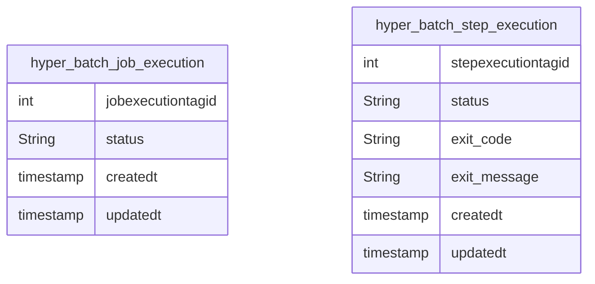

```mermaid
classDiagram 
    class expiration {
        +_int4 notifiedtype
        +timestamp endtime
        +String linkedaccount
        +String reservedinstanceid
    }

    class send_standard {
        +String sendType
        +boolean useyn
    }
    
    class usage_notification {
        +int sendamount
        +String sumtype
        +Long send_standard_id
    }
    usage_notification -- send_standard
    
    class email_address {
        +int useridx
        +String email
        +int languageid
        +boolean isSubscripion
    }
    
    class email_group {
        +String name
        +_text emailidlist
        +int useridx
    }
    email_address -- email_group
    
    class tag_standard {
        +long id
        +String tagname
    }
    
    class email_mapping {
        +long emailid
        +int useridx
        +int tagid 
        +int tableid
    }
    email_mapping -- email_address
    email_mapping -- tag_standard
    email_mapping <|-- usage_notification
    email_mapping <|-- expiration
    
    class expiration_target {
      +_String emails
      +_long tableids
      +_String expirationids
      +_String linkedaccount
      +_String notifiedtypes
    }
    expiration_target "*"--"1" email_mapping

  class hyper_batch_execution {
    +int executiontagid
    +text sendcontent
    +timestamp billingdt
    +timestamp senddt
  }
  hyper_batch_execution "*"--"1" expiration_target
  hyper_batch_execution "1"--"1" email_mapping : 사용량 알림
  
```

# 🪴 career-WBS
> mermaid로 작성된 과제는 마크다운 파일(WBS.md)로 올려주시면 됩니다. (md 파일 내에 기존 구조를 넣어주세요)  
> 별도 아키택쳐나 모델링 도구를 사용한 경우에는 마크다운 파일(WBS.md)과 png, gif, jpg, pdf 파일 형식으로 WBS-{gitID}.png 파일명으로 upload 해주세요
# 요구사항
- [x] 개선하려는 프로젝트의 최종 설계
    - [x] 변경 사항에 대한 Target 시스템 설계를 확정한다. (2주차 미션 활용)
    - [x] 변경 사항에 대한 기대효과를 확정한다. (2주차 미션 활용)
- [x] task list 도출
    - [x] 현 시스템에서 변경되는 부분을 class diagram(DB변경이 발생할 경우 ERD추가)으로 작성
    - [x] 변경, 추가 될 프로그램들의 작업 목록을 작성한다.
- [ ] 일정 계획 문서 (WBS)
  - [ ] 작업목록의 소요일정을 산정 한다.
  - [ ] 작업 목록의 의존성을 정의 한다.
  - [ ] 작업 목록의 전체 일정을 작성한다.
  - [ ] 진행 상태를 check하기위한 마일스톤 설정 한다.

# 🚀미션
## AS-IS

### AS-IS 개선포인트 분석

- __과중한 단일 Job__:\
  현재 배치 Job이 너무 많은 기능을 수행하고 있으며, 다양한 타입의 알림을 한 번에 처리하고 있습니다. 이는 작성한 사람만 아는 코드가 되버립니다.
- __Job의 작동시간__:\
  하나의 Job이 과도하게 크고 복잡할 경우, 실행 시간이 길어지며 이는 고객에게 알림을 전달하는 시간의 지연을 초래할 수 있습니다.\
  중간에 실패한 타입 때문에 전체 Job이 재실행되는 구조는 효율성을 크게 저하시키며, 이는 시스템 자원의 낭비와 서비스 지연을 초래할 수 있습니다.
- __테스트 환경의 불안정성__:\
  배치 테스트는 개발(dev) 환경의 Elasticsearch 서버에 직접 요청하여 진행되고 있습니다. 이로 인해 테스트 데이터의 유무에 따라 테스트 결과가 변동되는 문제가 있습니다.

### AS-IS 프로세스

### Class diagram
- AS-IS 구조에서 개선을 할때 영향을 받게되는 class diagram을 작성한다.

### ERD
-AS-IS 구조에서 개선을 할때 영향을 받게되는 ERD를 작성한다.

## TO-BE 
### TO-BE 기대효과 분석

- __개별 Job__:\
  타입별 Job을 나눠준다. 그리고 각기 Job들이 한가지 알림을 처리하도록 한다.
- __테스트 개선__:\
  배치 테스트에서 외부 서버를 Mocking해서 테스트가 다른 서버에 의존하지 않도록 한다.
- __Job 상태 저장__:\
  특정 잡이 실패했을 때, 현재는 batch_job_execution에서 실패 이유를 추적해야하였는데,\
  이를 개선하기 위해서 특정 잡의 실행 상태와 이유를 저장한다.  

### TO-BE 프로세스

### class diagram
- class diagram

```mermaid
classDiagram 
    class expiration {
        +_int4 notifiedtype
        +timestamp endtime
        +String linkedaccount
        +String reservedinstanceid
    }

    class send_standard {
        +String sendType
        +boolean useyn
    }
    
    class usage_notification {
        +int sendamount
        +String sumtype
        +Long send_standard_id
    }
    usage_notification -- send_standard
    
    class email_address {
        +int useridx
        +String email
        +int languageid
        +boolean isSubscripion
    }
    
    class email_group {
        +String name
        +_text emailidlist
        +int useridx
    }
    email_address -- email_group
    
    class tag_standard {
        +long id
        +String tagname
    }
    
    class email_mapping {
        +long emailid
        +int useridx
        +int tagid 
        +int tableid
    }
    email_mapping -- email_address
    email_mapping -- tag_standard
    email_mapping <|-- usage_notification
    email_mapping <|-- expiration
    
    class expiration_target {
      +_String emails
      +_long tableids
      +_String expirationids
      +_String linkedaccount
      +_String notifiedtypes
    }
    expiration_target "*"--"1" email_mapping

  class hyper_batch_execution {
    +int executiontagid
    +text sendcontent
    +timestamp billingdt
    +timestamp senddt
  }
  hyper_batch_execution "*"--"1" expiration_target
  hyper_batch_execution "1"--"1" email_mapping : 사용량 알림
  
  class hyper_batch_job_execution {
    +int jobexecutiontagid
    +String status
    +timestamp batchdt
  }
  hyper_batch_job_execution "1"--"1" hyper_batch_execution

  class hyper_batch_step_execution {
    +int stepexecutiontagid
    +String status
    +String exit_code
    +String exit_message
    +timestamp batchdt
  }
  hyper_batch_step_execution "*"--"1" hyper_batch_job_execution

```

### ERD
- TO-BE 구조에서 변경되는 ERD를 작성한다.

## Task List
1. 기존 Job, Step 분석 및 설계
2. Job을 Type 별 개별 Job으로 분리
2. 사용량/Sp 알림의 Job 내부 Step의 일별, 월별 별 분리
4. 잡 실행시 성공 및 실패 케이스 로그가 아닌 DB 저장
  1. 세부 잡, 스탭 테이블 설계
  2. 결과 저장 코드 추가
5. 테스트 개선
    1. 테스트 결과가 저장되지 않고 롤백되도록 변경
    2. 외부 서비스의 경우 mocking
    3. 테스트를 Step, Job별 테스트로 분리

## WBS

- 산정 기준 : 4시간/일

1. 요구사항 분석 : 이미수행
2. 설계 : 3d
3. 일정산정: 1d
4. 기존 Job, Step 분석 및 설계: 3d
5. Job을 Type 별 개별 Job으로 분리: 2d
6. 사용량/Sp 알림의 Job 내부 Step의 일별, 월별 별 분리: 3d
7. 잡 실행시 성공 및 실패 케이스 로그가 아닌 DB 저장: 3d
  1. 세부 잡, 스탭 테이블 설계: 1d
  2. 결과 저장 코드 추가: 2d
8. 테스트 개선: 7d
    1. 테스트 결과가 저장되지 않고 롤백되도록 변경: 5d
    2. 외부 서비스의 경우 mocking: 1d
    3. 테스트를 Step, Job별 테스트로 분리: 1d

```mermaid
gantt
    dateFormat  YYYY-MM-DD
    title       결제 재처리 WBS
    excludes    weekends, 2023-12-25, 2024-01-01
    %% (`excludes` accepts specific dates in YYYY-MM-DD format, days of the week ("sunday") or "weekends", but not the word "weekdays".)

    section prepare
    요구사항분석                                           :done,    des1, 2023-12-01, 10d
    설계                                                 :done,  des2, 2023-12-11, 3d
    일정산정                                              :done, des3, after des2, 1d
    deploy project 종료                                  :active, deploy, 2024-01-03  , 22d
    
    section 기존 코드 분석 및 분리
    기존 Job, Step 분석 및 설계                            :des4, after deploy , 3d
    Job을 Type 별 개별 Job으로 분리                        :des5, after des4, 2d
    사용량/Sp 알림의 Job 내부 Step의 일별, 월별 별 분리       :des6, after des5, 3d

    section 잡 실행시 성공 및 실패 케이스 로그가 아닌 DB 저장
    세부 잡, 스탭 테이블 설계                               :b1, after des6,2d
    결과 저장 코드 추가                                    :b2, after b1, 1d

    section 테스트 개선
    테스트 결과가 저장되지 않고 롤백되도록 변경                :c1, after b2, 2d
    외부 서비스의 경우 mocking                             :c2, after c1, 1d
    테스트를 Step, Job별 테스트로 분리                      :c3, after c2, 1d

    section 테스트
    Test & QA                                           :after c3, 2d

```

