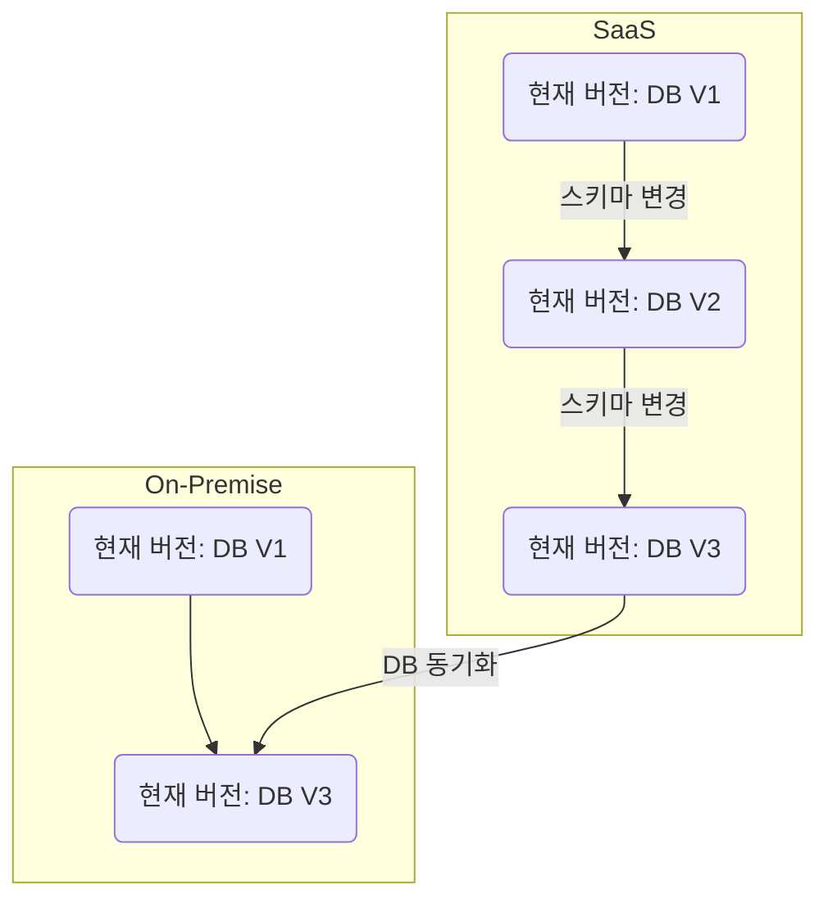
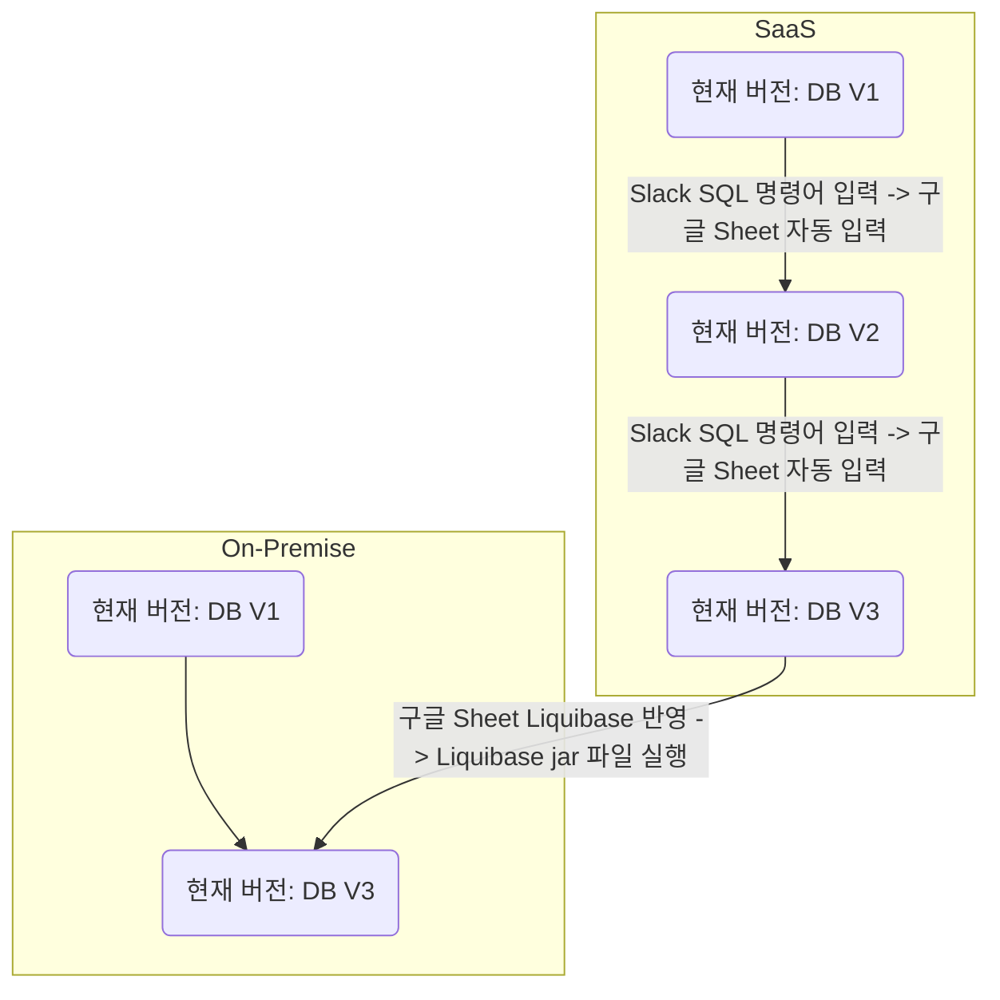
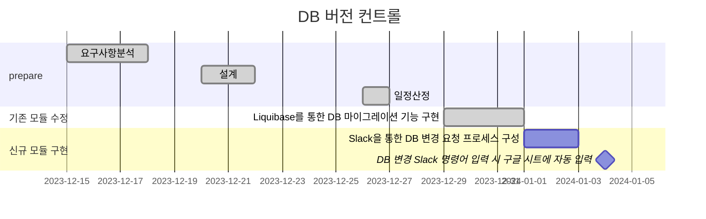

# 🪴 career-WBS
> mermaid로 작성된 과제는 마크다운 파일(WBS.md)로 올려주시면 됩니다. (md 파일 내에 기존 구조를 넣어주세요)  
> 별도 아키택쳐나 모델링 도구를 사용한 경우에는 마크다운 파일(WBS.md)과 png, gif, jpg, pdf 파일 형식으로 WBS-{gitID}.png 파일명으로 upload 해주세요
# 요구사항
- [x] 개선하려는 프로젝트의 최종 설계
    - [x] 변경 사항에 대한 Target 시스템 설계를 확정한다. (2주차 미션 활용)
    - [x] 변경 사항에 대한 기대효과를 확정한다. (2주차 미션 활용)
- [x] task list 도출
    - [x] 현 시스템에서 변경되는 부분을 class diagram(DB변경이 발생할 경우 ERD추가)으로 작성
    - [x] 변경, 추가 될 프로그램들의 작업 목록을 작성한다.
- [x] 일정 계획 문서 (WBS)
  - [x] 작업목록의 소요일정을 산정 한다.
  - [x] 작업 목록의 의존성을 정의 한다.
  - [x] 작업 목록의 전체 일정을 작성한다.
  - [x] 진행 상태를 check하기위한 마일스톤 설정 한다.

# 🚀미션
## AS-IS
### AS-IS 개선포인트 분석
- On-Premise와 Saas 환경이 있다.
- Saas 환경의 경우 자주 스키마가 변경되며 Saas DB의 스키마가 변경될 때 On-Premise DB의 스키마는 변경되지 않는다
- Saas DB 스키마 변경 시 추후 On-Premise DB와 동기화를 위해 스키마 변동 사항이 버전 별로 관리되어야 하는데 구글 Docs에다 변경 사항을 기록하는 정책이 있지만 스키마 변경 후에 기록하지 않는 경우가 많으며 스키마 변경을 기록한다고 하더라도 API, 코어 버전 태그를 기입하지 않고 있어 API, 코어, DB의 최신 버전으로만 동기화가 가능하다
- On-Premise 버전 업데이트를 하기 위해서는 모든 테이블의 스키마를 비교해야 하는 상황이어서 별도의 DB 마이그레이션 툴을 사용하도록 변경하지 않는다면 수백개의 테이블을 비교해야 해서 최소 1일 이상의 리소스가 소요된다.
- 스키마 변경 시에는 해당 스키마 변경될 때의 여러 프로젝트의 태그가 잘 관리되어야 한다.
- 스키마 변경과 관련된 API 버전 또는 코어 버전 등의 관리가 되어야 한다.
- DB 마이그레이션 툴을 사용해서 On-Premise 버전에 적용하는 식으로 변경되어야 한다.
 
### AS-IS 프로세스

## TO-BE 
### TO-BE 기대효과 분석
- DB 변경 요청 프로세스를 정립한다
- DB 변경 요청 시 구글 시트를 자동 기입함으로써
- DB 스키마 변경 버전이 관리된다
- DB migration 시 Liquibase를 사용하여 간단하고 편리하게 한다

### TO-BE 프로세스

## Task List
1. Slack 명령어를 통한 DB 변경 요청 프로세스 구성
2. DB 변경 Slack 명령어 입력 시 구글 시트에 자동 입력
3. Liquibase를 통한 DB 마이그레이션 기능 구현

## WBS

1. 요구사항 분석 : 이미수행
2. 설계 : 2d
3. 일정산정: 1d
4. Slack 명령어를 통한 DB 변경 요청 프로세스 구성 : 2d
5. DB 변경 Slack 명령어 입력 시 구글 시트에 자동 입력 : 2d
6. Liquibase를 통한 DB 마이그레이션 기능 구현 : 이미수행

