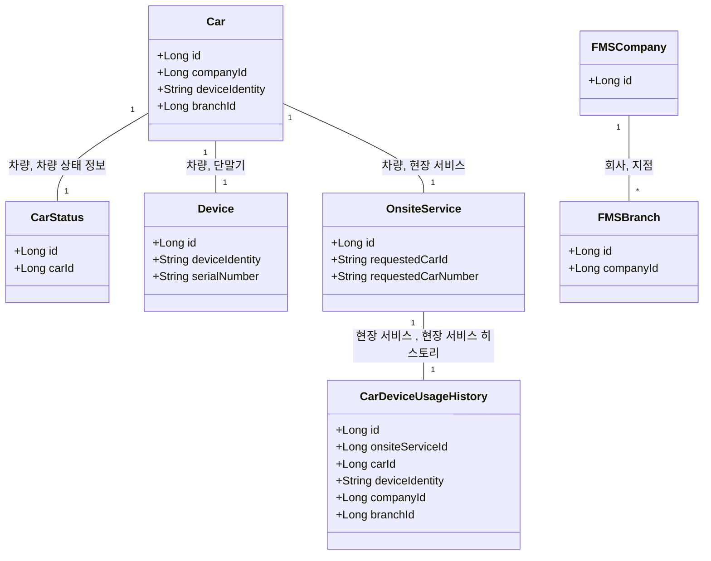
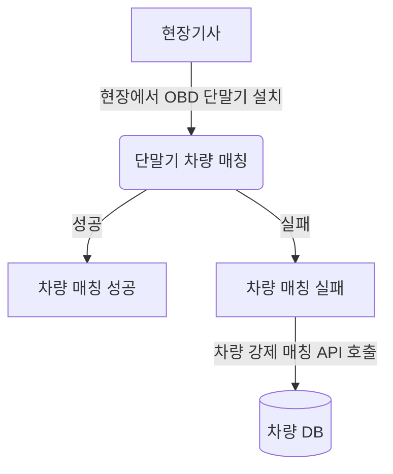
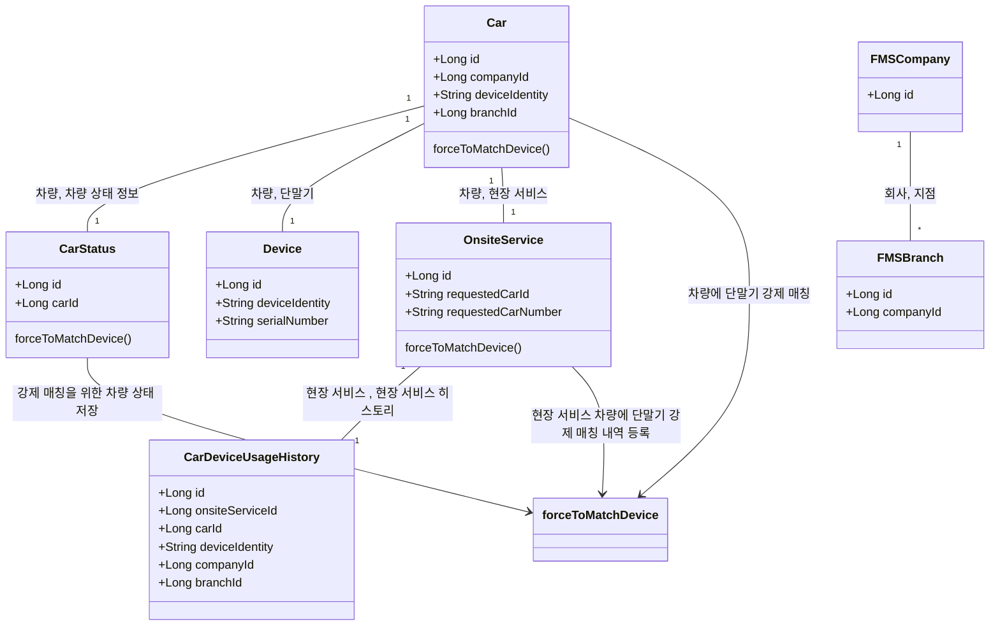
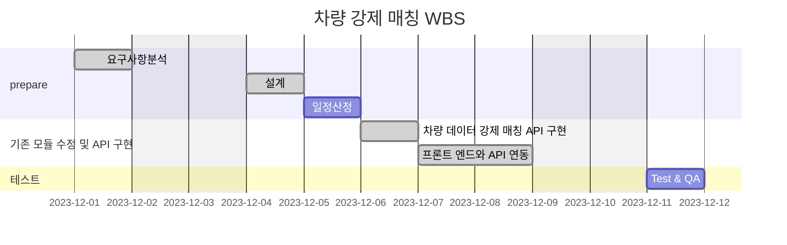

# 🪴 career-WBS
> mermaid로 작성된 과제는 마크다운 파일(WBS.md)로 올려주시면 됩니다. (md 파일 내에 기존 구조를 넣어주세요) <br>
> 별도 아키택쳐나 모델링 도구를 사용한 경우에는 마크다운 파일(WBS.md)과 png, gif, jpg, pdf 파일 형식으로 WBS-{gitID}.png 파일명으로 upload 해주세요
# 요구사항
- [ ] 개선하려는 프로젝트의 최종 설계
    - [ ] 변경 사항에 대한 Target 시스템 설계를 확정한다. (2주차 미션 활용)
    - [ ] 변경 사항에 대한 기대효과를 확정한다. (2주차 미션 활용)
- [ ] task list 도출
    - [ ] 현 시스템에서 변경되는 부분을 class diagram(DB변경이 발생할 경우 ERD추가)으로 작성
    - [ ] 변경, 추가 될 프로그램들의 작업 목록을 작성한다.
- [ ] 일정 계획 문서 (WBS)
  - [ ] 작업목록의 소요일정을 산정 한다.
  - [ ] 작업 목록의 의존성을 정의 한다.
  - [ ] 작업 목록의 전체 일정을 작성한다.
  - [ ] 진행 상태를 check하기위한 마일스톤 설정 한다.


# 🚀미션
## AS-IS
### AS-IS 개선포인트 분석
- 차량에 OBD 단말기를 설치하기 위해 차량이 있는 현장에 설치 기사가 현장 출동을 한다.
- 설치 기사가 단말기를 차량에 설치하고 연동을 하기 위해 설치 프로세스를 진행한다.
- 차량이 주차 되 있는 곳이 1층 이거나 탁 트인 주차랑의 경우에는 설치 프로세스를 진행 할 때는 설치가 잘 진행된다. 
- 그러나 종종 단말기와 서버가 통신이 잘 되지 않는 지하 주차장인 경우가 종종 있다.
- 이러한 경우에는 단말기와 서버가 연동이 제대로 되지 않아, 물리적 설치만(단말기와 차량) 진행한다.
- 그 이후 단말기를 서버와 연동하기 위해 연동에 필요한 단말기 정보 및 차량 데이터를 SQL로 DB 넣는 업무 비용이 발생한다.
- 이를 간단하게 관리자 화면에 API 만들어서 간단하게 입력 및 버튼으로 비용을 줄일 것으로 기대된다.
 
### AS-IS 프로세스


### Class diagram
- AS-IS 구조에서 개선을 할때 영향을 받게되는 class diagram을 작성한다.



### ERD
-AS-IS 구조에서 개선을 할때 영향을 받게되는 ERD를 작성한다.

```mermaid
없음  
```


## TO-BE 
### TO-BE 기대효과 분석
- 통신이 좋지 않아 현장 기사가 단말기를 설치 작업만 하고 단말기와 자동차를 데이터 매칭을 하지 못할 경우, 즉각 대처 가능
- 운영 비용 및 CS 처리 비용 감소
 
### TO-BE 프로세스


### class diagram
- class diagram

    

### ERD
- TO-BE 구조에서 변경되는 ERD를 작성한다.
```mermaid
없음
```

## Task List
1. 차량 강제 매칭하기 위한 테이블 및 클래스 분석 <br>
2. 기능 구현하기 위해 프론트 엔드와 필요한 데이터 분석<br>
3. 차량 강제 매칭 API 구현<br>
4. 구현 후 프론트 엔드에게 API 개발 내용 문서 전달 및 피드백<br>
5. 프론트 엔드와 연동 및 테스트<br>
6. QA 및 테스트<br>


## WBS

- 산정 기준 : 4시간/일

1. 요구사항 분석 : 이미수행
2. 설계 : 1d
3. 일정산정: 1d
4. 차량 데이터 강제 매칭 API 구현 : 1d
5. 프론트 엔드와 API 연동 : 2d
6. Test & QA  : 1d



