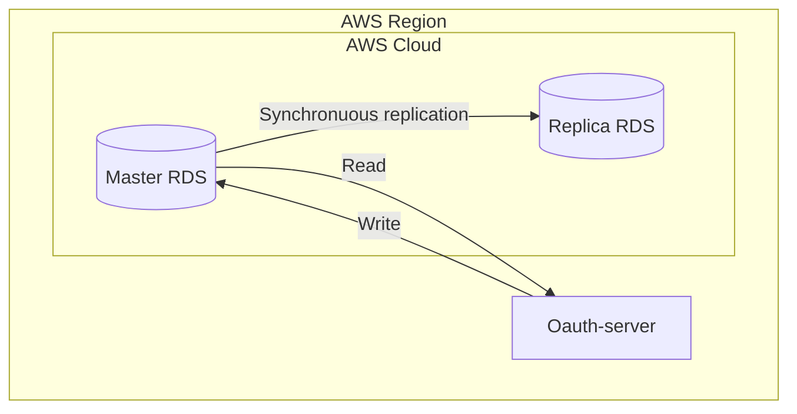
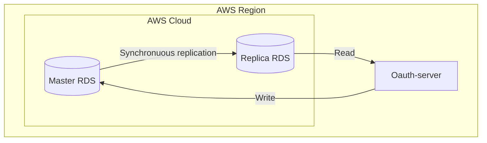
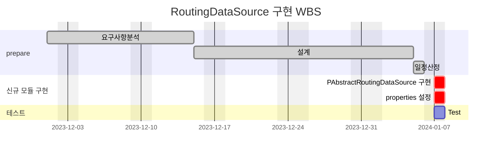
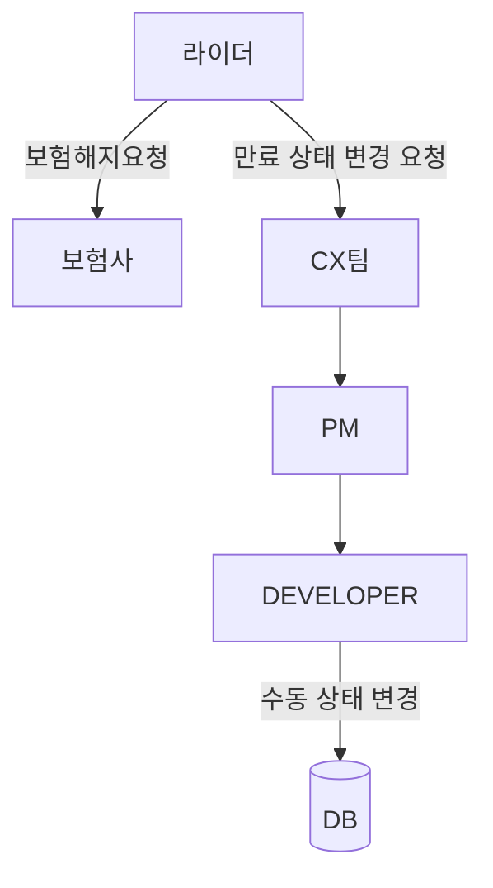
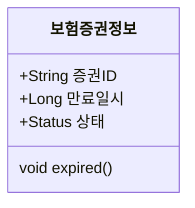
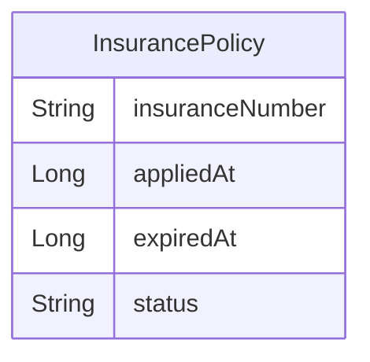
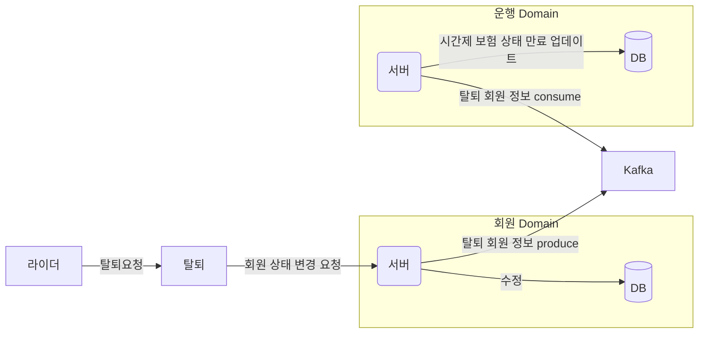
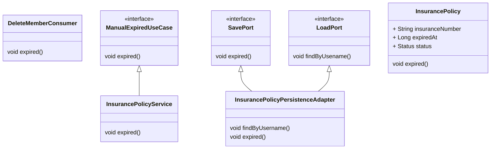
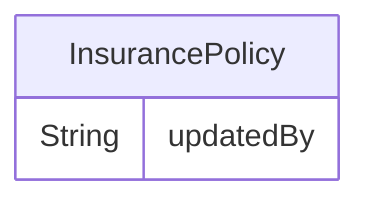
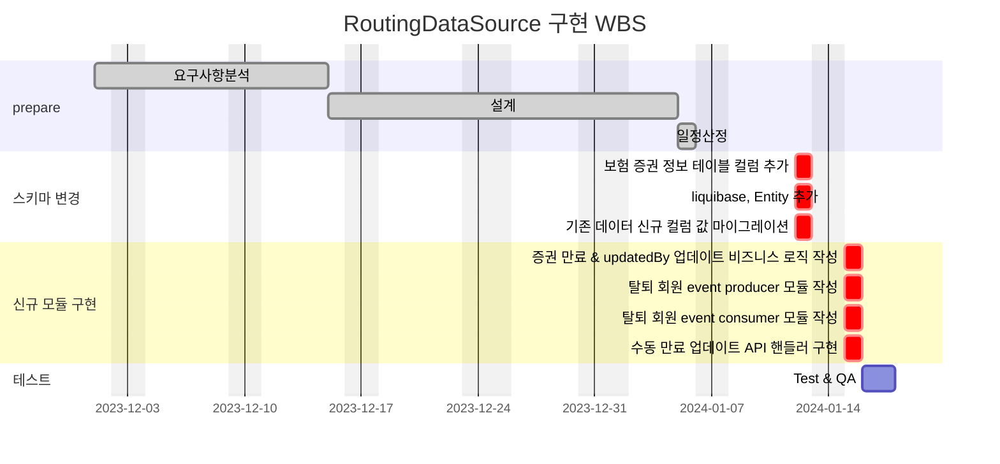

# 🚀 미션
## 1. master / slave DB 사용
## AS-IS
### AS-IS 개선포인트 분석
- 현재 인증서버에서는 master database 만 사용하고 있다.
- read transaction 이 write 보다 2배 더 많다.
- 로그인할 때마다 데이터 업데이트를 하고 있고 로그인 요청이 몰리는 시간대에 잘 사용하고 있던 클라이언트에게 영향이 갈 수 있음
- 슬로우 쿼리등의 이슈가 있을 때마다 트래픽이 증가하면 서버에 엄청난 부하를 주게됨 (실제로 인덱스 하나 서버가 죽는 장애가 발생한 적이 있음)
- 커맨드 성 작업들이 대량으로 이루어질 때 서버나 DB 의 부하가 우려됨
- 확인해 보니 replica rds 가 실제로 존재하고 있으나 (sre 팀에서 기본으로 구성해뒀음) 활용하지 못하고 있었음

### AS-IS 프로세스


### Class diagram
- AS-IS 구조에서 개선을 할때 영향을 받게되는 class diagram을 작성한다.
```
없음
```

### ERD
- AS-IS 구조에서 개선을 할때 영향을 받게되는 ERD를 작성한다.
```
없음
```

## TO-BE
### TO-BE 기대효과 분석
- 쿼리 요청을 분담함으로써 DB 부하를 분산할 수 있다. (현재 Read transaction 이 Write transaction 에 비해 2배 정도 많다.)
- Slave 중 하나를 Master로 활용하면 되기 때문에 데이터를 백업하는 용도로도 사용할 수 있다.
- 트래픽이 늘어남에 따른 병목현상을 완화 시킬 수 있다.

### TO-BE 프로세스


### Class diagram
- TO-BE 구조에서 개선을 할때 영향을 받게되는 class diagram을 작성한다.
```
없음
```

### ERD
- TO-BE 구조에서 개선을 할때 영향을 받게되는 ERD를 작성한다.
```
없음
```

## Task List
1. AbstractRoutingDataSource 클래스로 다중 DataSource 를 묶고 키를 통해 동적으로 라우팅하도록 설정
2. mater, slave properties 설정 (application.yaml)

## WBS

- 산정 기준 : 6시간/일

1. 요구사항 분석 : 이미수행
2. 설계 : 13d
3. 일정산정: 1d
4. AbstractRoutingDataSource 구현: 1d
5. properties 설정: 1d 
6. Test: 1d



## 2. 시간제 보험 만료 상태 업데이트
## AS-IS
### AS-IS 개선포인트 분석
- 시간제 보험에 가입되어 있는 라이더가 존재한다.
- 보험 해지는 직접 보험사 페이지에서 신청 혹은 유선 전화로 신청하고 우리쪽 서버로 만료 콜백을 받는다.
- 하지만 바로 만료 콜백을 주지 않는 상황이며 (보험제휴사 사정) 라이더는 만료 신청 후에도 보험료가 부과될 수 있다.(해지 시점을 기준으로 부과된 보험료는 청구되지 않는다.)
- 추후 조치로 보험료가 부과되지는 않지만 CX 쪽으로 불편사항이 접수되어 개발자가 수동으로 유효기간을 만료 시키고 있다.
- 유효기간을 만료시키기 위해 해당 라이더의 개인정보를 받아야하며 약간의 커뮤니케이션 비용이 발생한다. (CX -> PM -> DEVELOPER)
- 위와 같은 요청이 일주일에 1~2 건 정도 발생한다.
- 탈퇴 회원에 대해서도 별도의 유효기간 종료 액션을 취하지 않기 때문에 (최대 2달 회원 삭제 유효기간 존재) 해지 신청을 했음에도 라이더가 보험 만료를 확인하지 못하면 CX 에 요청하여
  위와 같은 커뮤니케이션을 거쳐 수동으로 유효기간 만료로 상태를 업데이트 해주고 있다.
- 한 건당 개인정보 조회, 수정, 수정 확인 약 15분 정도의 고정 비용이 발생하고 있다.

### AS-IS 프로세스


### Class diagram
- AS-IS 구조에서 개선을 할때 영향을 받게되는 class diagram을 작성한다.


### ERD
- AS-IS 구조에서 개선을 할때 영향을 받게되는 ERD를 작성한다.


## TO-BE
### TO-BE 기대효과 분석
- 관리자가 라이더의 보험 상태를 변경할 수 있는 API 를 제공한다.
- 라이더 회원 탈퇴시 이벤트 방식으로 운행서버에서 이벤트를 컨슈밍하여 탈퇴 회원의 존재하는 시간제보험 상태를 만료로 업데이트 한다.
- 비효율적인 수동 데이터 수정에 걸리는 30분 정도의 시간을 제거할 수 있다.
- CX 팀과 개발팀간의 커뮤니케이션이 필요없어진다.
- 이벤트 방식으로 작동하므로 추후 타 도메인에 회원 탈퇴 후에 적용되어야 할 액션이 생긴다면 추가하기 쉽다.

### TO-BE 프로세스
- 보험 해지 요청


- 탈퇴 요청


### Class diagram
- TO-BE 구조에서 개선을 할때 영향을 받게되는 class diagram을 작성한다.


### ERD
- TO-BE 구조에서 개선을 할때 영향을 받게되는 ERD를 작성한다.
- 컬럼 추가


## Task List
1. 탈퇴된 회원의 증권 정보를 만료로 업데이트하는 API 생성 (어드민 웹 사용)
2. 회원 서버에서 탈퇴 회원 데이터 토픽을 프로듀싱
3. 운행 서버에서 탈퇴 회원 데이터 컨슘 받는 클래스 생성
4. 보험 증권 정보 테이블에 updateBy 컬럼 추가
   1. liquibase 추가
   2. 기존 데이터 신규 컬럼 값 마이그레이션
5. 탈퇴 회원 증권 정보가 존재할 경우 증권을 만료로 업데이트 (내부 동작 / 1번 API 의 비즈니스 로직과 동일)

## WBS

- 산정 기준 : 6시간/일

1. 요구사항 분석 : 이미수행
2. 설계 : 13d
3. 일정산정: 1d
4. 스키마 변경: 1d
   1. 보험 증권 정보 테이블 컬럼 추가: 0.2d
   2. liquibase, Entity 추가: 0.2d
   3. 기존 데이터 신규 컬럼 값 마이그레이션: 0.6d
5. 증권 만료 & updatedBy 업데이트 비즈니스 로직 작성: 0.5d
6. 탈퇴 회원 event producer 모듈 작성: 0.2d
7. 탈퇴 회원 event consumer 모듈 작성: 0.2d
8. 수동 만료 업데이트 API 핸들러 구현: 0.1d


