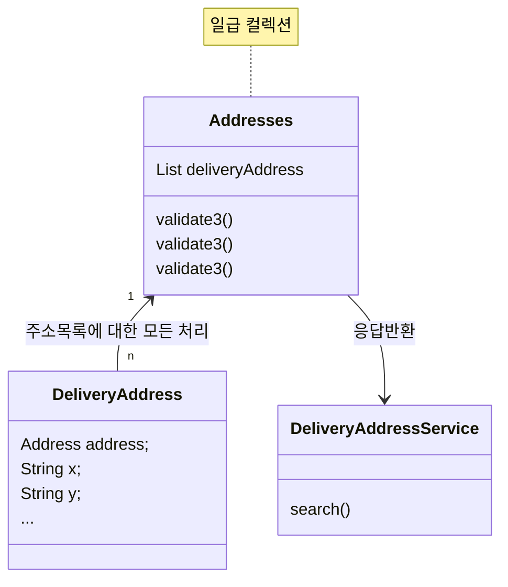
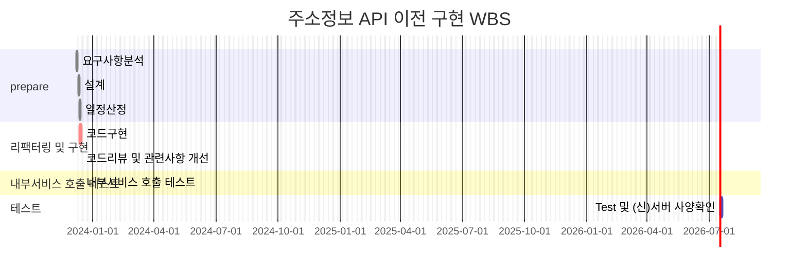

# 🪴 career-WBS
> mermaid로 작성된 과제는 마크다운 파일(WBS.md)로 올려주시면 됩니다. (md 파일 내에 기존 구조를 넣어주세요)  
> 별도 아키택쳐나 모델링 도구를 사용한 경우에는 마크다운 파일(WBS.md)과 png, gif, jpg, pdf 파일 형식으로 WBS-{gitID}.png 파일명으로 upload 해주세요
# 요구사항
- [ ] 개선하려는 프로젝트의 최종 설계
    - [ ] 변경 사항에 대한 Target 시스템 설계를 확정한다. (2주차 미션 활용)
    - [ ] 변경 사항에 대한 기대효과를 확정한다. (2주차 미션 활용)
- [ ] task list 도출
    - [ ] 현 시스템에서 변경되는 부분을 class diagram(DB변경이 발생할 경우 ERD추가)으로 작성
    - [ ] 변경, 추가 될 프로그램들의 작업 목록을 작성한다.
- [ ] 일정 계획 문서 (WBS)
  - [ ] 작업목록의 소요일정을 산정 한다.
  - [ ] 작업 목록의 의존성을 정의 한다.
  - [ ] 작업 목록의 전체 일정을 작성한다.
  - [ ] 진행 상태를 check하기위한 마일스톤 설정 한다.

# 🚀미션
## TO-BE
### class diagram
- class diagram

## Task List
1. (구)서버 주소관련 API 분석
2. (신)서버 API 구현
3. 내부 서비스 (신)서버 API 호출 테스트
    1. (신)서버 트래픽 증가에 대비한 서버사양 확인
    2. 다른 서비스도 (신)서버 API 호출 하도록 전환

## WBS
1. 요구사항 분석 : 이미수행
2. 설계 : 2d
   1. OpenApi 파악(k사, n사)
   2. 주소검증 관련 로직 파악(예외 케이스들 상당 수 존재)
3. 일정산정: 1d
4. 리팩터링 및 구현 : 3d
    1. 코드구현 : 2d
    2. 코드리뷰 및 관련사항 개선 : 1d
5. 내부서비스 호출 테스트 : 1d
6. (신)서버 사양확인 : 1d

